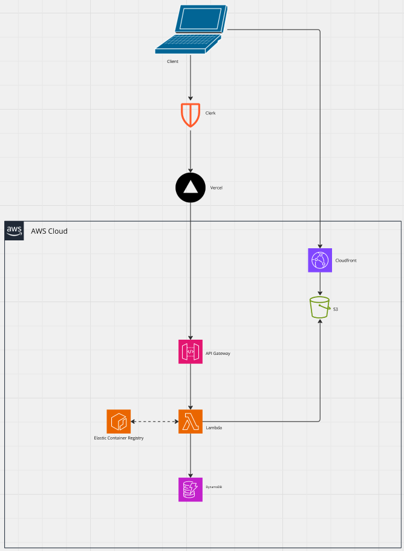

# Skillfully

Skillfully is a full-stack learning management platform inspired by Udemy. It allows users to browse and enroll in courses, while instructors can create and manage course content. Features include user authentication, progress tracking, and secure payments.

## 🏗️ Architecture

The app uses a serverless architecture on AWS:

- **Frontend**: Next.js with Clerk for auth and Redux for state
- **Backend**: Express.js wrapped with `serverless-http`, deployed to **AWS Lambda**
- **Database**: DynamoDB via Dynamoose
- **Auth**: Clerk.dev
- **Payments**: Stripe
- **Routing**: API Gateway + Lambda

